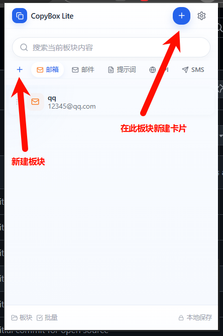
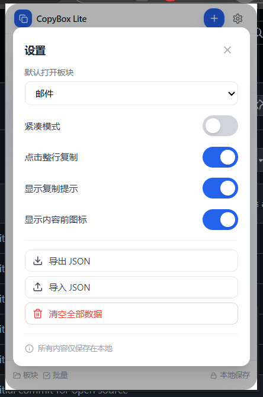

# CopyBox Lite

一款专为 **Google Chrome** 和 **Microsoft Edge** 浏览器打造的**剪贴板与快捷短语管理插件扩展**。

它能帮你将常用的文本、回复话术、API、代码片段等分门别类地保存起来。基于 React 18 和 Tailwind CSS 开发，支持无缝的多板块分类、一键快速复制与顺滑的拖拽重排，极大提升你的日常工作与文本管理效率。

## 📸 功能预览与详细介绍

### 1. 高效的主界面与快捷操作

- **全局搜索**：顶部的搜索框支持实时过滤当前板块内的内容，海量短语中也能秒速定位。
- **快捷新建**：
  - **新建板块**：左侧 `+` 号直接增加新的横向分类标签。
  - **新建卡片**：点击右上角醒目的蓝色 `+` 号按钮，即可一键在当前板块内添加新的快捷短语。
- **快速切换**：直观的顶部 Tab 栏，一键切换不同的工作上下文。

### 2. 灵活的板块分类管理

- **自定义分类**：支持无限制创建板块（如：邮箱、提示词、API、网址命令等），对剪贴板内容进行精细化分类。
- **直观的统计**：每个板块下方会实时展示当前包含的内容条数。
- **自由管理**：提供便捷的编辑和删除入口，一键整理废弃或过时的板块。

### 3. 丰富且贴心的设置选项

- **基础偏好设置**：
  - **默认打开板块**：支持自定义每次呼出插件时默认展示的板块，直达最常用的分类。
  - **紧凑模式**：开启后缩小列表项间距，一屏可查看更多数据内容。
  - **点击整行复制**：开启后，无需精准点击右侧的小图标，点击整行任意位置即可完成复制。
  - **显示复制提示**：复制成功后提供轻量级的视觉反馈，确保操作生效。
  - **显示内容前图标**：支持显示或隐藏内容项的专属标识图标，让界面更符合个人审美。
- **数据安全与迁移**：
  - **完全本地化**：所有内容数据均仅保存在浏览器本地 API 中，**绝对不会上传**，确保百分百的隐私安全。
  - **导入 / 导出 JSON**：支持将你的所有快捷短语导出为 JSON 备份文件，换电脑时轻松实现一键恢复。
  - **危险操作防护**：一键清空功能提供红色警示，防止误删心血数据。

## 💻 技术栈

*   **前端核心**：React 18 + TypeScript + Vite + Tailwind CSS
*   **拖拽交互库**：@dnd-kit/core, @dnd-kit/sortable
*   **浏览器接口**：Chrome Extension API (@types/chrome)
*   **构建工具**：Vite + tsc

## 🚀 快速上手与运行

### 1. 安装依赖与构建

```bash
# 安装依赖
npm install

# 编译并打包插件产物 (输出到 dist/ 目录)
npm run build
```

### 2. 在 Chrome 浏览器中加载插件

1.  打开 Chrome 浏览器，进入地址栏输入：`chrome://extensions/`。
2.  在右上角开启 **开发者模式** (Developer mode)。
3.  点击左上角 **加载已解压的扩展程序** (Load unpacked)。
4.  在弹出的文件选择器中，选择本项目编译生成的 `dist` 文件夹即可完成加载。

## 📄 许可证

基于 [MIT License](./LICENSE) 协议开源。
